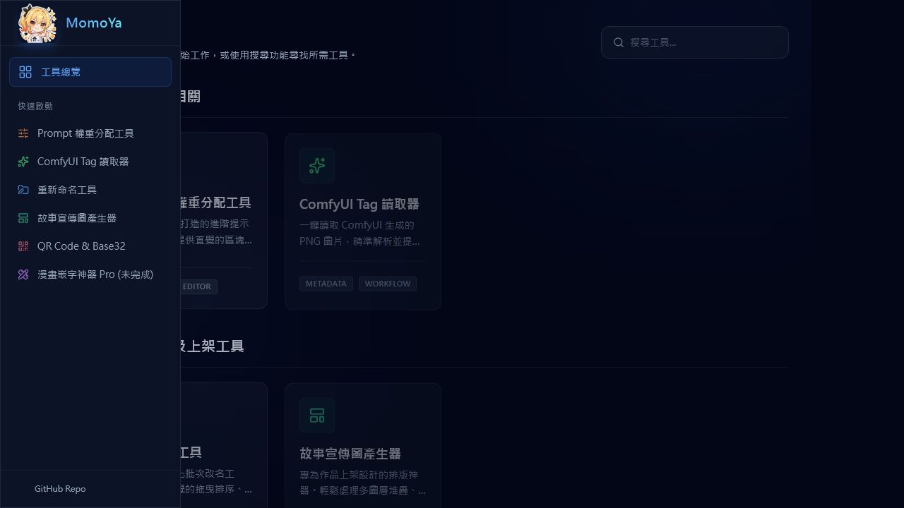
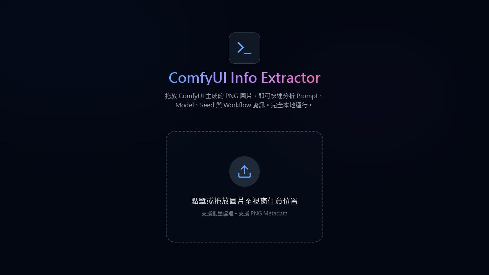
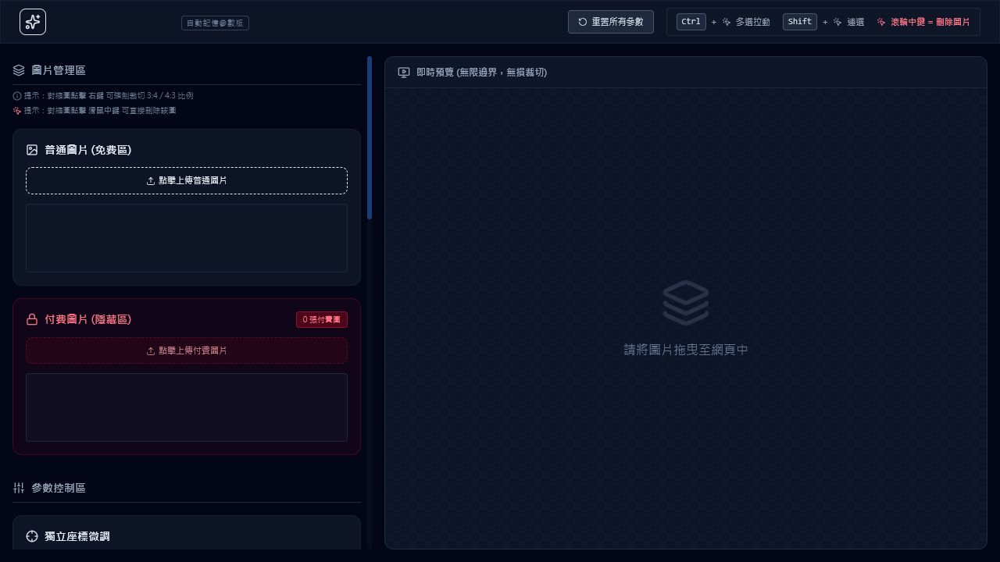
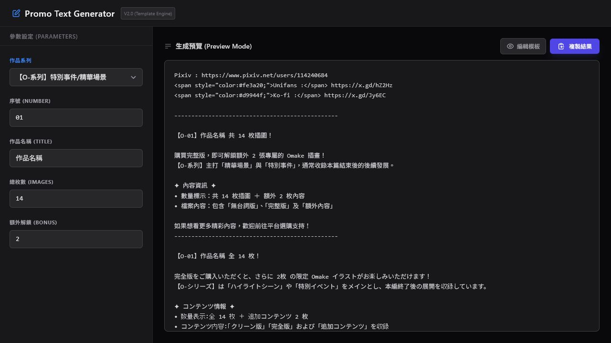
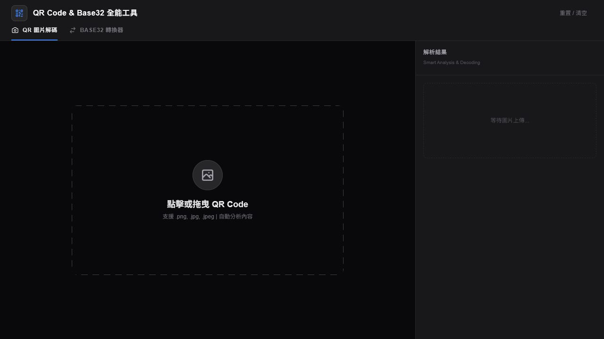
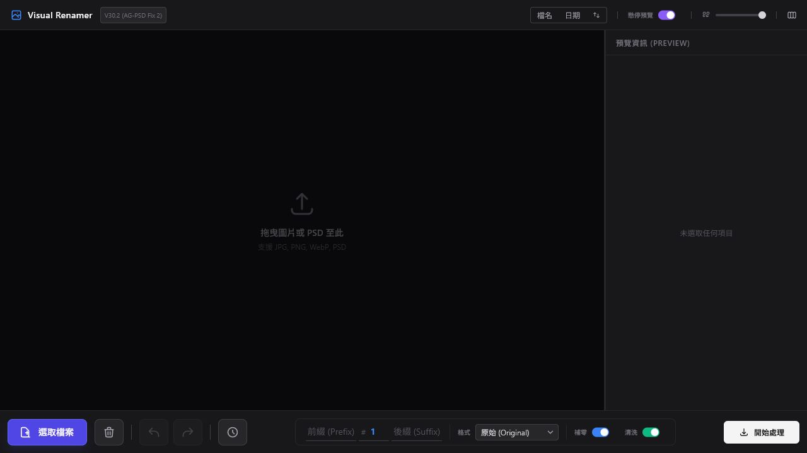
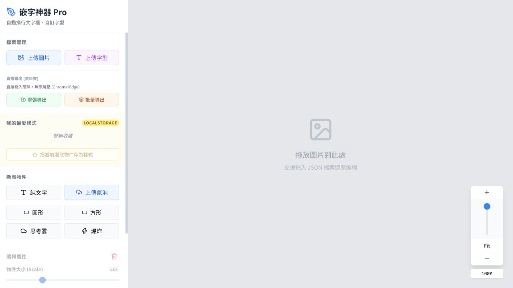
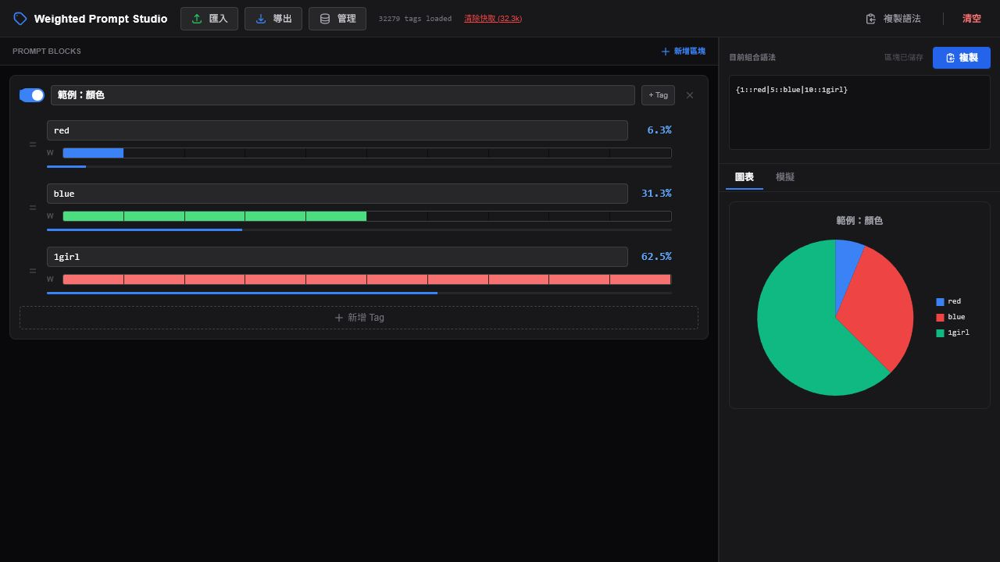

# ComfyUI Tools 逐頁 UX 改善建議

日期：2026-07-29  
檢視範圍：8 個 HTML 頁面的桌面初始狀態（1280 × 720）  
主要使用目標：讓使用者更快找到工具、理解下一步、完成輸入與輸出，同時降低誤操作與學習成本。

## 總結

整體已經有清楚的深色視覺語言，多數頁面也能在第一眼辨認主要功能。最值得優先處理的不是重新設計，而是：

1. 修正首頁在 1280px 寬度下被側欄遮住／裁切的版面問題。
2. 為所有文工具加入一致的「返回工具首頁」與頁面標題列。
3. 將複雜工具改成「輸入 → 調整 → 預覽 → 匯出」的漸進流程。
4. 補齊欄位、檔案上傳、滑桿與圖示按鈕的可存取名稱、鍵盤操作與焦點狀態。
5. 統一成功、錯誤、載入、空狀態、危險操作確認，以及中英用詞。

## 1. 工具首頁

整體狀況：需要優先修正。

### 做得好的地方

- 左側快速啟動與主區分類能幫助使用者理解工具分組。
- 卡片有名稱、用途、標籤和啟動行動，資訊模型完整。
- 搜尋放在右上方，位置符合預期。

### 改善建議

1. **先修正主內容被側欄遮住／裁切。** 在 1280px 畫面中，歡迎文字、分類標題和第一欄卡片都被切掉。主內容應使用明確的 sidebar offset，並在 1024–1440px 做回歸測試。
2. **讓整張工具卡可點，保留一個清楚的「開啟」行動。** 目前「在新分頁開啟」圖示按鈕重複且可存取名稱相同，讀屏使用者無法分辨它們屬於哪個工具。
3. **強化搜尋狀態。** 顯示搜尋結果數、無結果建議和清除按鈕；不要只依靠 placeholder 當標籤。
4. **收斂未完成工具。** 將 WIP 工具放入可折疊「實驗中」區域，避免和可用工具有同等視覺權重。
5. **提高次要文字與標籤對比。** 卡片說明、分類文字和標籤偏暗，小尺寸時閱讀吃力。
6. **將 GitHub Repo 指向實際專案。** 若還沒有公開 repo，先隱藏，避免通用首頁連結降低信任感。

## 2. ComfyUI Tag Extractor

整體狀況：主流程清楚，但缺少狀態與可存取性支援。

### 做得好的地方

- 單一任務頁很聚焦，視線會自然落在上傳區。
- 「完全本地運行」是重要的隱私 reassurance，值得保留。
- 標題、說明、拖放區的層級清楚。

### 改善建議

1. **把拖放區做成真正可操作的「選擇 PNG」按鈕。** 目前檔案輸入沒有清楚的可存取名稱，鍵盤與讀屏使用者難以使用。
2. **說清楚輸入限制。** 補上單檔／批量、檔案大小、支援 PNG metadata 類型，以及不支援時會發生甚麼。
3. **加入處理狀態。** 至少要有解析中、成功數量、無 metadata、格式錯誤、移除單張與重新選擇。
4. **在空狀態預告輸出。** 用簡短清單說明會得到 Prompt、Model、Seed、Workflow，降低使用者上傳前的不確定感。
5. **加入一致的返回入口。** 頁面左上應能返回工具首頁，不要依賴瀏覽器返回。

## 3. ImageStacker／故事宣傳圖產生器

整體狀況：功能完整，但第一屏的認知負荷偏高。

### 做得好的地方

- 免費區／付費區用顏色和分區清楚區隔。
- 左側管理、右側預覽的工作台結構適合這類工具。
- 匯出動作和即時預覽的關係容易理解。

### 改善建議

1. **改成四階段工作流。** 用「1 上傳、2 排列、3 遮罩與徽章、4 匯出」取代一開始就顯示所有參數。
2. **只在有選取內容時顯示相關控制。** 未選圖時折疊座標、旋轉、模糊、徽章位置等設定。
3. **不要把滑鼠手勢當成唯一操作方法。** Ctrl、Shift、中鍵、右鍵應有對應的可見按鈕與鍵盤操作，也要兼容觸控裝置。
4. **將「自動記憶參數版」改成次要狀態。** 主標題只保留產品名稱；在旁邊用「已自動儲存」狀態說明記憶行為。
5. **補齊滑桿標籤。** 畫面有大量滑桿，但程式化名稱不足；每個滑桿應關聯可見 label，並提供單位與目前值。
6. **增加安全網。** 提供復原／重做、重置單一區塊、離開前保存提示，以及清除全部圖片的確認。

## 4. PixivTemplateGenerator

整體狀況：結構成熟，主要需要改善用詞與輸出呈現。

### 做得好的地方

- 左參數、右預覽的即時生成模式高效。
- 「複製結果」是清楚的主要行動。
- 欄位數量控制得宜，沒有過多設定。

### 改善建議

1. **統一產品名稱與介面語言。** 建議使用「Pixiv 宣傳文案產生器」，把 `Promo Text Generator`、`Parameters`、`Preview Mode` 等英文移到輔助說明或移除。
2. **區分「渲染預覽」與「原始碼」。** 現在 `` 直接出現在預覽中，容易讓人以為輸出錯誤；可提供「預覽／原始碼」切換。
3. **讓欄位標籤真正關聯輸入框。** 不要只靠相鄰文字或 placeholder，並為數字欄位提供合理最小值與錯誤訊息。
4. **讓複製回饋靠近按鈕。** 顯示短暫的「已複製」狀態，並在沒有有效內容時停用。
5. **把模板編輯視為進階功能。** 放入次要頁面或抽屜，避免一般使用者誤改模板；提供預覽、版本與還原。

## 5. QRCodeDecode

整體狀況：分頁模式清楚，但空狀態空間分配不理想。

### 做得好的地方

- QR 解碼與 Base32 分頁區隔，兩種任務不會互相干擾。
- 上傳區與結果區在同一畫面，符合使用者預期。
- 支援格式與自動分析有明確說明。

### 改善建議

1. **縮小初始拖放區，放大結果區。** 上傳前可以居中；上傳後切成圖片預覽、解析內容、行動按鈕三區。
2. **加入安全的內容辨識。** 清楚標示結果是網址、文字、Wi-Fi 或其他格式；網址先顯示完整目的地，不要自動開啟。
3. **改善結果行動。** 提供「複製文字」「安全地開啟連結」「重新掃描」，並讓危險網址有警示。
4. **統一用詞。** 分頁可改成「QR 解碼」與「Base32 編解碼」，減少 `Smart Analysis & Decoding` 這類不必要的混語。
5. **提高空狀態與重置按鈕對比。** 現在右側提示和右上重置太淡，容易被忽略。
6. **補齊檔案輸入與文字區的標籤。** 支援鍵盤上傳，並清楚區分 Base32 輸入與輸出。

## 6. Rename／Visual Renamer

整體狀況：桌面工作台合理，但工具列資訊偏擠。

### 做得好的地方

- 中央檔案區、右側預覽、底部命名規則符合批次改名流程。
- 「開始處理」固定在右下，容易找到。
- 復原、重做、操作日誌顯示了對批量操作風險的重視。

### 改善建議

1. **在處理前顯示「原檔名 → 新檔名」預覽。** 這是批量改名最重要的防錯機制，應比圖片預覽更優先。
2. **把底部控制分成命名、格式、隱私三組。** 現在前綴、號碼、後綴、格式、補零、清洗擠在一列，掃讀成本高。
3. **把「清洗」改成「移除 EXIF」。** 說明會重新編碼，並在可能失去 metadata 或畫質時提示。
4. **讓排序狀態更明確。** 使用「檔名／日期」分段控制，加上升冪／降冪文字，不只用箭頭。
5. **統一版本顯示。** 頁面 title 是 V30.3、畫面是 V30.2，應只保留一個可靠版本來源。
6. **補齊圖示按鈕標籤與焦點樣式。** 清除、復原、重做、日誌等不能只靠圖示與 hover 說明。

## 7. TextWeb／嵌字神器 Pro

整體狀況：工作區清楚，但與其他工具的視覺和操作模式不一致。

### 做得好的地方

- 左側物件工具、中央畫布、右下縮放是熟悉的編輯器模式。
- 上傳圖片、上傳字型、氣泡種類與匯出功能分組合理。
- 空畫布沒有不必要的干擾。

### 改善建議

1. **在畫布空狀態加入明確主按鈕。** 直接提供「上傳第一張圖片」，並簡述「上傳 → 加文字／氣泡 → 匯出」。
2. **未選取物件時收起編輯屬性。** 避免顯示不能理解或不能操作的縮放、傾斜、圖層控制。
3. **把 `LocalStorage` 改成使用者語言。** 建議寫「樣式只儲存在此瀏覽器」，並提供匯出／匯入樣式。
4. **說清楚兩種匯出差異。** 「單張導出」「批量導出」「直接寫入硬碟」需要檔案格式、目的地與瀏覽器支援說明。
5. **統一外觀與導航。** 此頁是亮色，其他工具多為深色；至少共用同一頁首、品牌和返回入口，或提供主題切換。
6. **補齊刪除、縮放等圖示按鈕的名稱。** 檔案與字型上傳也應是可聚焦、有標籤的標準控制項。

## 8. Wildcard／Weighted Prompt Studio

整體狀況：功能強、視覺回饋好，但新手門檻高。

### 做得好的地方

- 區塊、標籤權重、語法與圖表同屏，修改後的影響很直觀。
- 百分比與圓餅圖能快速幫助理解權重分布。
- 範例資料讓頁面不會從完全空白開始。

### 改善建議

1. **統一術語。** 建議將 `Prompt Blocks`、`Tag`、`W` 改成「提示詞區塊」「標籤」「權重」，專有語法放在說明中。
2. **把資料庫管理移到次要區域。** 32,279 tags、清除快取、匯入／導出會搶走主要任務注意力，可收進「資料庫」抽屜。
3. **讓權重同時可精確輸入。** 除滑桿外提供數字欄位、總權重和即時驗證；不要只用顏色傳達不同項目。
4. **把範例標示得更明確。** 加上「這是範例，可安全刪除」以及一鍵建立自己的第一個區塊。
5. **完善載入與錯誤狀態。** 自動載入大量 CSV 時要有進度、重試、離線／快取說明；不要讓載入遮罩無限停留。
6. **保護清空與清除快取。** 兩者都應說明影響範圍並確認，且要提供可恢復方式。
7. **提升圖表可存取性。** 保留圖例文字和百分比表格，加入非顏色辨識方式，確保鍵盤能重新排序與刪除標籤。

## 跨頁優先次序

### P0：立即處理

- 修正首頁在常見桌面寬度下的裁切與遮擋。
- 為所有頁面加入共用頁首、返回工具首頁與一致的品牌名稱。

### P1：下一輪

- 補齊所有輸入、檔案上傳、滑桿、圖示按鈕的標籤、鍵盤操作與焦點樣式。
- 把 ImageStacker、Rename、TextWeb、Wildcard 改成漸進式流程，先顯示當前步驟需要的設定。
- 統一空狀態、載入、成功、錯誤、複製完成和危險操作確認。

### P2：視覺與內容整理

- 統一中英文用詞、版本標籤、色彩對比與頁面標題。
- 為每個工具加入簡短範例、輸入限制、隱私說明和輸出預告。
- 將前端樣式與依賴預先打包，減少載入時短暫錯版或空白狀態。

## 證據限制

- 本次只檢視桌面初始狀態，沒有上傳個人圖片或執行會產生檔案的操作。
- 未完成手機版、200% 縮放、完整鍵盤走查、讀屏器測試或精確對比度量測。
- 因此可指出可見風險與程式化名稱缺口，但不能宣稱已通過完整 WCAG 檢驗。
